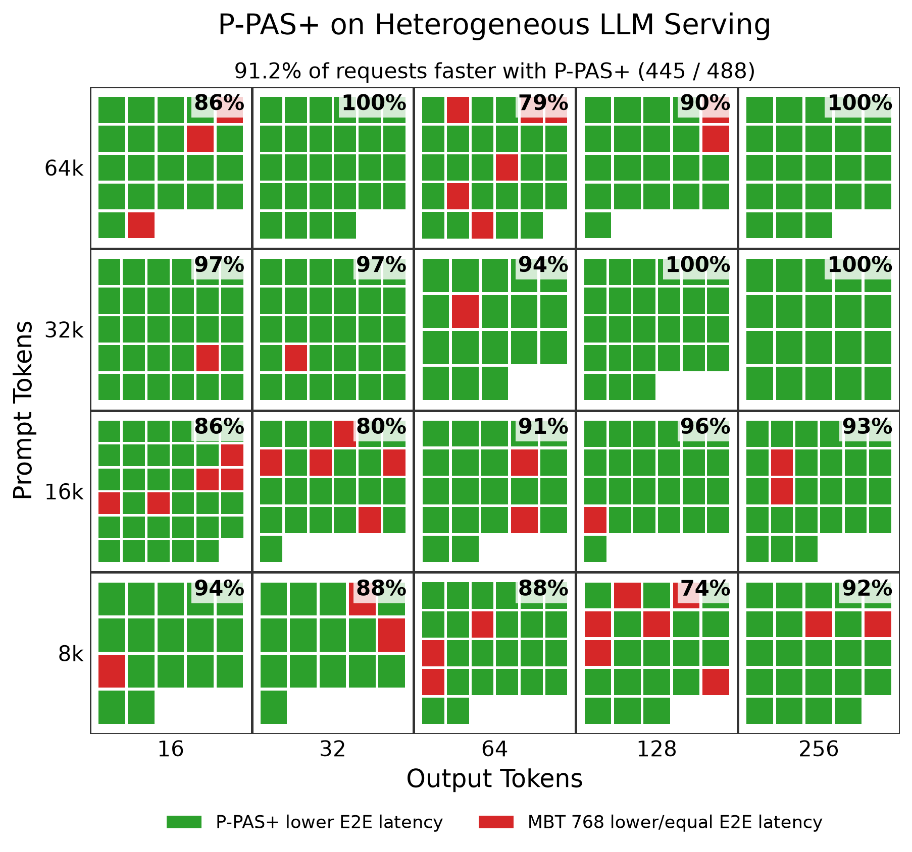
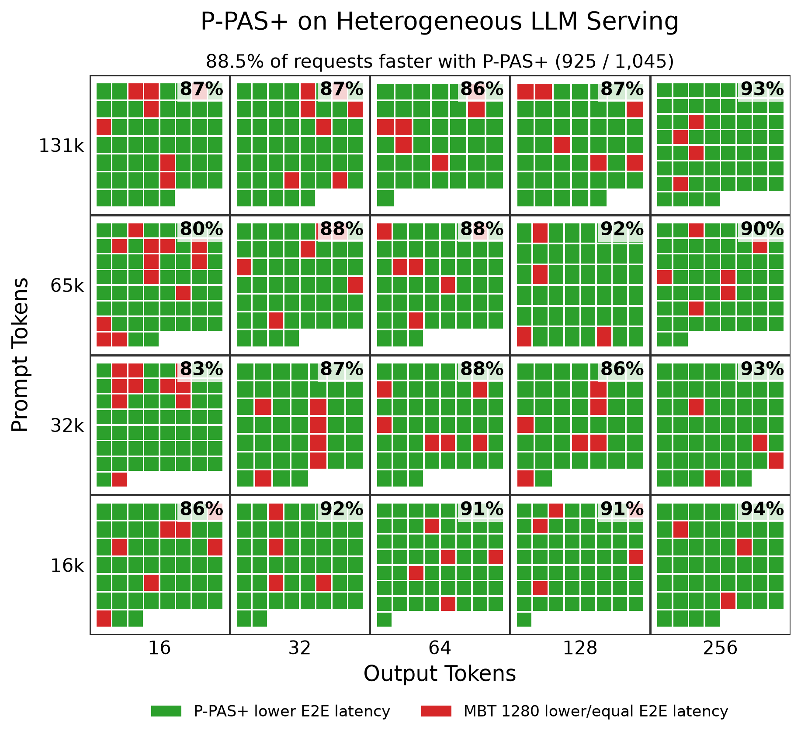

# P-PAS: Prefill-Pressure Adaptive Scheduling for Long-Context LLM Serving

P-PAS dynamically adapts the vLLM token scheduling budget to current serving
pressure. Large token budgets can be beneficial under low pressure, while
smaller budgets can reduce latency when prefill and decode work compete for
GPU resources.

> **Paper:** [P-PAS: Prefill-Pressure Adaptive Scheduling for Long-Context LLM Serving](https://arxiv.org/abs/2608.15171)  
> Timo Sämann

## P-PAS+

The original P-PAS was designed around homogeneous long-context workloads,
where requests have similar prompt and output lengths. In these workloads,
counting concurrent prefills provides a useful signal of serving pressure
because the requests are similar in size.

P-PAS+ extends the policy to heterogeneous workloads, where request sizes can
differ substantially. Here, simply counting prefills can miss important
pressure: one large prefill can create more work than several smaller prefills.

P-PAS+ therefore retains the original P-PAS pressure condition and adds a
second condition for a single large running prefill overlapping with multiple
active decodes. The "+" refers to this additional pressure condition.

The policy remains lightweight and uses only scheduler-visible state. It does
not require an additional model or additional GPU resources.

## Heterogeneous Workload Evaluation

P-PAS+ was evaluated on two recent NVFP4 models using vLLM 0.27.1:

- **Qwen3.8-27B NVFP4**
- **NVIDIA Nemotron-3.5-Lightning-30B-A3B-NVFP4**

Both evaluations use heterogeneous prompt/output distributions and changing
serving pressure. P-PAS+ is compared against multiple static vLLM token
budgets and the original P-PAS.

Reported workload-level improvements give equal weight to each of the six
workload conditions and are calculated as

$$
\text{Improvement} =
\left(
1 - \frac{1}{N}\sum_{w=1}^{N}
\frac{M_{\mathrm{P\text{-}PAS+},w}}{M_{\mathrm{baseline},w}}
\right) \times 100\%,
$$

where \(M\) is the evaluated metric and \(N=6\). Positive values indicate an
improvement with P-PAS+.

### Qwen3.8-27B NVFP4

P-PAS+ was evaluated with **Qwen3.8-27B NVFP4** on an
**NVIDIA GeForce RTX 5090** using vLLM 0.27.1.

The heterogeneous workload contains requests spanning:

- 8k to 64k prompt tokens
- 16 to 256 output tokens
- six burst conditions combining two burst rates and three burst durations

Each workload condition consists of a low-pressure phase at 0.05 requests/s,
a burst at either 0.1 or 0.4 requests/s, and a final low-pressure phase at
0.05 requests/s. The burst duration is 10, 20, or 40 seconds:

| Burst rate | Burst duration | Phase schedule |
|---:|---:|---|
| 0.1 req/s | 10 s | `20:0.05, 10:0.1, 20:0.05` |
| 0.4 req/s | 10 s | `20:0.05, 10:0.4, 20:0.05` |
| 0.1 req/s | 20 s | `20:0.05, 20:0.1, 20:0.05` |
| 0.4 req/s | 20 s | `20:0.05, 20:0.4, 20:0.05` |
| 0.1 req/s | 40 s | `20:0.05, 40:0.1, 20:0.05` |
| 0.4 req/s | 40 s | `20:0.05, 40:0.4, 20:0.05` |

The evaluation covers 488 matched logical requests across these six
workload conditions. The complete benchmark required approximately 15 GPU
hours.

P-PAS+ was compared against six static token budgets and the original P-PAS:

| Comparison                   | Mean E2E improvement |
|------------------------------|---:|
| vs MBT 512                   | +23.55% |
| **vs MBT 768 (best static)** | **+3.02%** |
| vs MBT 1024                  | +9.68% |
| vs MBT 2048 (vLLM default)   | +3.32% |
| vs MBT 4096                  | +7.14% |
| vs MBT 8192                  | +4.45% |
| vs P-PAS                     | +0.56% |

MBT 768 was the best tested static configuration for mean E2E latency.
Against MBT 768, P-PAS+ achieved:

- **3.02% lower mean E2E latency**
- **3.01% lower P95 E2E latency**
- **1.57% lower makespan**
- lower mean and P95 E2E latency in **all six workload conditions**

Across the 488 exactly matched requests, P-PAS+ achieved lower E2E latency
than MBT 768 for **445 requests (91.2%)**.

Each square represents one matched request. Green indicates lower E2E latency
with P-PAS+; red indicates lower or equal E2E latency with static MBT 768.

For additional metrics and detailed comparisons, see `evaluate_results.py`
and the raw benchmark output in `results/qwen/ppas_heterogeneous_qwen.txt`.

### NVIDIA Nemotron-3.5-Lightning-30B-A3B-NVFP4

P-PAS+ was evaluated with
**NVIDIA Nemotron-3.5-Lightning-30B-A3B-NVFP4** on an
**NVIDIA GeForce RTX 5090** using vLLM 0.27.1.

The heterogeneous workload contains requests spanning:

- 16k to 128k prompt tokens
- 16 to 256 output tokens
- six burst conditions combining two burst rates and three burst durations

Each workload condition consists of a low-pressure phase at 0.1 requests/s,
a burst at either 0.2 or 0.8 requests/s, and a final low-pressure phase at
0.1 requests/s. The burst duration is 10, 20, or 40 seconds:

| Burst rate | Burst duration | Phase schedule |
|---:|---:|---|
| 0.2 req/s | 10 s | `20:0.1, 10:0.2, 20:0.1` |
| 0.8 req/s | 10 s | `20:0.1, 10:0.8, 20:0.1` |
| 0.2 req/s | 20 s | `20:0.1, 20:0.2, 20:0.1` |
| 0.8 req/s | 20 s | `20:0.1, 20:0.8, 20:0.1` |
| 0.2 req/s | 40 s | `20:0.1, 40:0.2, 20:0.1` |
| 0.8 req/s | 40 s | `20:0.1, 40:0.8, 20:0.1` |

The evaluation covers 1,045 matched logical requests across these six
workload conditions. The complete benchmark required approximately 18 GPU
hours.

P-PAS+ was compared against six static token budgets and the original P-PAS:

| Comparison                    | Mean E2E improvement |
|-------------------------------|---:|
| vs MBT 1024                   | +14.9% |
| **vs MBT 1280 (best static)** | **+3.1%** |
| vs MBT 2048 (vLLM default)    | +17.0% |
| vs MBT 4096                   | +16.4% |
| vs MBT 8192                   | +18.4% |
| vs MBT 16384                  | +21.2% |
| vs P-PAS                      | +1.4% |

MBT 1280 was the best tested static configuration for mean E2E latency.
Against MBT 1280, P-PAS+ achieved:

- **3.1% lower mean E2E latency**
- **1.4% lower makespan**
- lower mean E2E latency in **all six workload conditions**

Across the 1,045 exactly matched requests, P-PAS+ achieved lower E2E latency
than MBT 1280 for **88.5% of requests**.

Each square represents one matched request. Green indicates lower E2E latency
with P-PAS+; red indicates lower or equal E2E latency with static MBT 1280.

For additional metrics and detailed comparisons, see `evaluate_results.py`
and the raw benchmark output in `results/nemotron/ppas_heterogeneous_final.txt`.

## How P-PAS Works

P-PAS dynamically switches between two manually selected token budgets:
a large budget `B_max` and a smaller budget `B_cap`.

The original P-PAS pressure condition is:

~~~text
active prefills >= 2 AND running decodes > 0
~~~

Under this condition, P-PAS switches to `B_cap`. Otherwise, it retains
`B_max`.

P-PAS+ preserves this behavior and additionally detects the case where one
large running prefill overlaps with multiple active decodes:

~~~text
original P-PAS pressure
OR
(
    running prefills == 1
    AND running decodes >= 2
    AND remaining running prefill tokens >= large-prefill threshold
)
~~~

The P-PAS+ parameters are selected per model/workload configuration.

For the Qwen heterogeneous evaluation:

~~~text
B_max = 2048
B_cap = 768
large-prefill threshold = 32768
~~~

For the Nemotron heterogeneous evaluation:

~~~text
B_max = 16384
B_cap = 1280
large-prefill threshold = 65536
~~~

The implementation modifies only the scheduler's global token budget.

## Additional Homogeneous P-PAS Results

The following experiments evaluate the original P-PAS policy on homogeneous
dynamic workloads with 20k input tokens and 32 output tokens.

### Qwen3.8-27B NVFP4

On a dynamic long-context workload, P-PAS reduced average end-to-end latency
by **14.7% compared with fixed MBT 2048**.

**Workload:** 20k input tokens, 32 output tokens, alternating serving pressure.

[View Qwen3.8-27B NVFP4 results (PDF)](figures/qwen38_27b_ppas.pdf)

### NVIDIA Nemotron-3.5-Lightning-30B-A3B-NVFP4

P-PAS achieved the lowest average end-to-end latency at every tested burst
rate, dynamically adapting between scheduling regimes that favor different
fixed token budgets.

**Workload:** 20k input tokens, 32 output tokens, alternating serving pressure.

[View Nemotron-3.5-Lightning-30B results (PDF)](figures/nemotron_30b_ppas.pdf)

## Repository Structure

~~~text
ppas-vllm/
├── benchmark.py
├── run_sweep.py
├── evaluate_results.py
├── scheduler/
│   ├── scheduler_ppas.py
│   └── ppas_vllm_0.27.1.patch
├── figures/
│   ├── overview_figure.png
│   ├── qwen38_27b_ppas_plus_request_wall.png
│   ├── nemotron_30b_ppas_plus_request_wall.png
│   ├── qwen38_27b_ppas.pdf
│   └── nemotron_30b_ppas.pdf
├── results/
│   ├── qwen/
│   └── nemotron/
├── LICENSE
└── README.md
~~~

## Installation

Create a Python environment and install vLLM:

~~~bash
conda create -n ppas-vllm python=3.12 -y
conda activate ppas-vllm

pip install vllm==0.27.1
~~~

P-PAS modifies the vLLM scheduler in:

~~~text
vllm/v1/core/sched/scheduler.py
~~~

The repository provides:

- `scheduler/ppas_vllm_0.27.1.patch` for vLLM 0.27.1
- `scheduler/scheduler_ppas.py` containing the complete modified scheduler

Apply the patch from the active Python environment:

~~~bash
SITE_PACKAGES=$(python -c "import site; print(site.getsitepackages()[0])")
cd "$SITE_PACKAGES"
patch -p1 < /path/to/ppas-vllm/scheduler/ppas_vllm_0.27.1.patch
~~~

The patched scheduler behaves like standard vLLM unless P-PAS or P-PAS+ is
explicitly enabled.

## Running P-PAS+

`run_sweep.py` can run P-PAS+, the original P-PAS, and static token budgets
over multiple workload conditions and random seeds.

For each workload condition and seed, the same generated request trace is
replayed across all scheduler configurations, enabling exact request-level
comparisons.

### Qwen3.8-27B Heterogeneous Evaluation

The Qwen heterogeneous evaluation was run with:

~~~bash
python run_sweep.py \
  --configs ppas_plus_qwen,ppas_qwen,512,768,1024,2048,4096,8192 \
  --seeds 0,1,2,3,4,5,6,7,8,9 \
  --models qwen_27b \
  --mixed-workload qwen_heterogeneous \
  --arrival-mode piecewise_poisson \
  --phases \
    20:0.05,10:0.1,20:0.05 \
    20:0.05,10:0.4,20:0.05 \
    20:0.05,20:0.1,20:0.05 \
    20:0.05,20:0.4,20:0.05 \
    20:0.05,40:0.1,20:0.05 \
    20:0.05,40:0.4,20:0.05 \
  --log-file results/qwen/ppas_heterogeneous_qwen.txt \
  --max-num-seqs 20
~~~

> **Qwen configuration note:** `--max-num-seqs 20` was used because the larger
> values used for Nemotron exceeded the available VRAM with Qwen3.8-27B.

The heterogeneous workload samples uniformly from 20 prompt/output
combinations:

~~~text
Prompt tokens:  8192, 16384, 32768, 65536
Output tokens:  16, 32, 64, 128, 256
~~~

The P-PAS+ Qwen configuration uses:

~~~text
B_max = 2048
B_cap = 768
large-prefill threshold = 32768
~~~

The original P-PAS configuration uses the same `B_max` and `B_cap`, without
the additional large-prefill condition.

Results can be evaluated with:

~~~bash
python evaluate_results.py \
  --input results/qwen/ppas_heterogeneous_qwen.txt
~~~

### Nemotron Heterogeneous Evaluation

The Nemotron heterogeneous evaluation was run with:

~~~bash
python run_sweep.py \
  --configs ppas_plus_nemotron,ppas_nemotron,1024,1280,2048,4096,8192,16384 \
  --seeds 0,1,2,3,4,5,6,7,8,9,10 \
  --models nemotron_30b \
  --mixed-workload nemotron_heterogeneous \
  --arrival-mode piecewise_poisson \
  --phases \
    20:0.1,10:0.2,20:0.1 \
    20:0.1,10:0.8,20:0.1 \
    20:0.1,20:0.2,20:0.1 \
    20:0.1,20:0.8,20:0.1 \
    20:0.1,40:0.2,20:0.1 \
    20:0.1,40:0.8,20:0.1 \
  --log-file results/nemotron/ppas_heterogeneous_final.txt
~~~

The heterogeneous workload samples uniformly from 20 prompt/output
combinations:

~~~text
Prompt tokens:  16384, 32768, 65536, 131072
Output tokens:  16, 32, 64, 128, 256
~~~

The P-PAS+ Nemotron configuration uses:

~~~text
B_max = 16384
B_cap = 1280
large-prefill threshold = 65536
~~~

The original P-PAS configuration uses the same `B_max` and `B_cap`, without
the additional large-prefill condition.

Results can be evaluated with:

~~~bash
python evaluate_results.py \
  --input results/nemotron/ppas_heterogeneous_final.txt
~~~

See all benchmark options with:

~~~bash
python run_sweep.py --help
~~~

> **Benchmarking note:** For stable latency measurements, run the benchmark on
> an otherwise idle GPU. GPU-accelerated desktop or browser activity can
> noticeably affect latency measurements when the benchmark GPU also drives
> the display.

## Paper Reproducibility

The experiments reported in the original P-PAS paper were performed with
**vLLM 0.22.1**.

The original implementation, benchmark configuration, raw results, and
profiling data are preserved in the release tag `v1.0-paper`.

The current branch uses **vLLM 0.27.1** and contains the newer P-PAS
implementation, P-PAS+, and additional experiments with recent models.

P-PAS+ and the heterogeneous workload evaluations described above are new and
are not part of the current paper.

## Citation

If you use P-PAS or this repository in your research, please cite:

~~~bibtex
@article{samann2026ppas,
  title={P-PAS: Prefill-Pressure Adaptive Scheduling for Long-Context LLM Serving},
  author={S{\"a}mann, Timo},
  journal={arXiv preprint arXiv:2608.15171},
  year={2026}
}
~~~

## License

This repository is licensed under the Apache License 2.0. See `LICENSE` for
details.