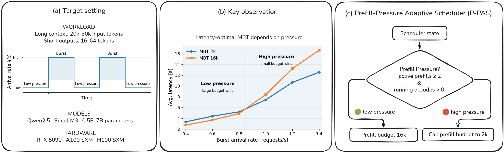

# P-PAS: Prefill-Pressure Adaptive Scheduling for Long-Context LLM Serving

P-PAS dynamically adapts the vLLM token scheduling budget to current serving
pressure. Large token budgets can be beneficial under low pressure, while
smaller budgets can reduce latency as concurrent prefill and decode work grows.

> **Paper:** [P-PAS: Prefill-Pressure Adaptive Scheduling for Long-Context LLM Serving](https://arxiv.org/abs/2608.15171)  
> Timo Sämann



## P-PAS on vLLM 0.27.1

P-PAS has been ported to **vLLM 0.27.1** and tested with recent
NVFP4 models on an NVIDIA GeForce RTX 5090.

### Qwen3.8-27B NVFP4

On a dynamic long-context workload, P-PAS reduced average end-to-end latency
by **14.7% compared with fixed MBT 2048**.

**Workload:** 20k input tokens, 32 output tokens, alternating serving pressure.

[View Qwen3.8-27B NVFP4 results (PDF)](figures/qwen38_27b_ppas.pdf)

### NVIDIA Nemotron-3.5-Lightning-30B-A3B-NVFP4

P-PAS achieved the **lowest average end-to-end latency at every tested burst
rate**, dynamically adapting between scheduling regimes that favor different
fixed token budgets.

**Workload:** 20k input tokens, 32 output tokens, alternating serving pressure.

[View Nemotron-3.5-Lightning-30B results (PDF)](figures/nemotron_30b_ppas.pdf)

## How P-PAS Works

P-PAS uses serving pressure to dynamically select the token scheduling budget:

- **Low pressure:** retain a large scheduling budget for efficient prefill.
- **Higher pressure:** constrain prefill work to reduce interference with active decoding.

The policy is implemented as a lightweight modification of the vLLM scheduler.

## Repository Structure

```text
ppas-vllm/
├── benchmark.py
├── run_sweep.py
├── evaluate_results.py
├── scheduler/
│   ├── scheduler_ppas.py
│   └── ppas_vllm_0.27.1.patch
├── figures/
│   ├── overview_figure.png
│   ├── qwen38_27b_ppas.pdf
│   └── nemotron_30b_ppas.pdf
├── results/
│   ├── qwen/
│   │   └── sweep_qwen.txt
│   └── nemotron/
│       └── sweep_nemotron.txt
├── LICENSE
└── README.md
```

## Installation

Create a Python environment and install vLLM:

```bash
conda create -n ppas-vllm python=3.12 -y
conda activate ppas-vllm

pip install vllm==0.27.1
```

P-PAS modifies the vLLM scheduler in:

```text
vllm/v1/core/sched/scheduler.py
```

The repository provides:

- `scheduler/ppas_vllm_0.27.1.patch` — patch against vLLM 0.27.1
- `scheduler/scheduler_ppas.py` — complete modified scheduler

Apply the patch from the active Python environment:

```bash
SITE_PACKAGES=$(python -c "import site; print(site.getsitepackages()[0])")
cd "$SITE_PACKAGES"
patch -p1 < /path/to/ppas-vllm/scheduler/ppas_vllm_0.27.1.patch
```

The patched scheduler behaves like standard vLLM unless P-PAS is enabled.

## Running P-PAS

`benchmark.py` contains presets for the configurations used in the current
Qwen and Nemotron experiments.

### Qwen3.8-27B NVFP4

```bash
python benchmark.py \
  --model qwen_27b \
  --prompt-tokens 20000 \
  --output-tokens 32 \
  --arrival-mode piecewise_poisson \
  --phases 10:0.1,10:0.8,10:0.1,10:0.8,10:0.1 \
  --configs ppas_qwen,768,2048 \
  --max-num-seqs 12
```

The Qwen P-PAS configuration uses:

```text
B_max = 2048
B_cap = 768
```

### NVIDIA Nemotron-3.5-Lightning-30B-A3B-NVFP4

```bash
python benchmark.py \
  --model nemotron_30b \
  --prompt-tokens 20000 \
  --output-tokens 32 \
  --arrival-mode piecewise_poisson \
  --phases 10:0.1,10:2.0,10:0.1,10:2.0,10:0.1 \
  --configs ppas_nemotron,1280,16384 \
  --max-num-seqs 12
```

The Nemotron P-PAS configuration uses:

```text
B_max = 16384
B_cap = 1280
```

The benchmark passes these settings to the modified scheduler through
`PPAS_ENABLED` and `PPAS_B_CAP`. The current benchmark already contains the
corresponding model entries and P-PAS presets. :contentReference[oaicite:0]{index=0} :contentReference[oaicite:1]{index=1}

See all options with:

```bash
python benchmark.py --help
```

> **Benchmarking note:** For stable latency measurements, run the benchmark on
> an otherwise idle GPU. GPU-accelerated desktop or browser activity can
> noticeably affect latency measurements when the benchmark GPU also drives
> the display.

## Paper Reproducibility

The experiments reported in the original P-PAS paper were performed with
**vLLM 0.22.1**.

The original implementation, benchmark configuration, raw results, and
profiling data are preserved in the corresponding paper release/tag.

This branch tracks the newer **vLLM 0.27.1 implementation** and additional
experiments with recent models.

## Citation

If you use P-PAS or this repository in your research, please cite:

```bibtex
@misc{sämann2026ppasprefillpressureadaptivescheduling,
      title={P-PAS: Prefill-Pressure Adaptive Scheduling for Long-Context LLM Serving},
      author={Timo Sämann},
      year={2026},
      eprint={2608.15171},
      archivePrefix={arXiv},
      primaryClass={cs.DC},
      url={https://arxiv.org/abs/2608.15171},
}
```

## License

This repository is licensed under the Apache License 2.0. See `LICENSE` for details.